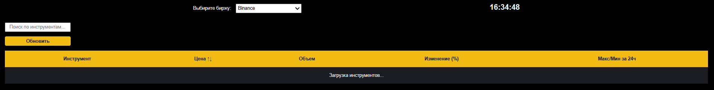
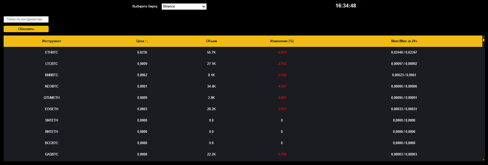
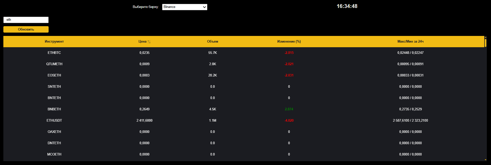
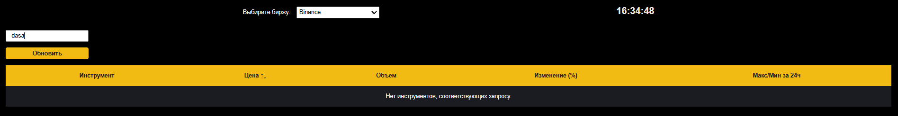

# Crypto-app


## This is a simple project that tracks changes in cryptocurrencies based on some criteria.

This project was generated using [Angular CLI](https://github.com/angular/angular-cli) version 19.2.4.

### #Start stage loading tools


### #Next stage getting tools



### #Sorting tools



### #If there are no tools matching your request.



## Development

To run the standard web version in development:

```bash
npm run start
```
